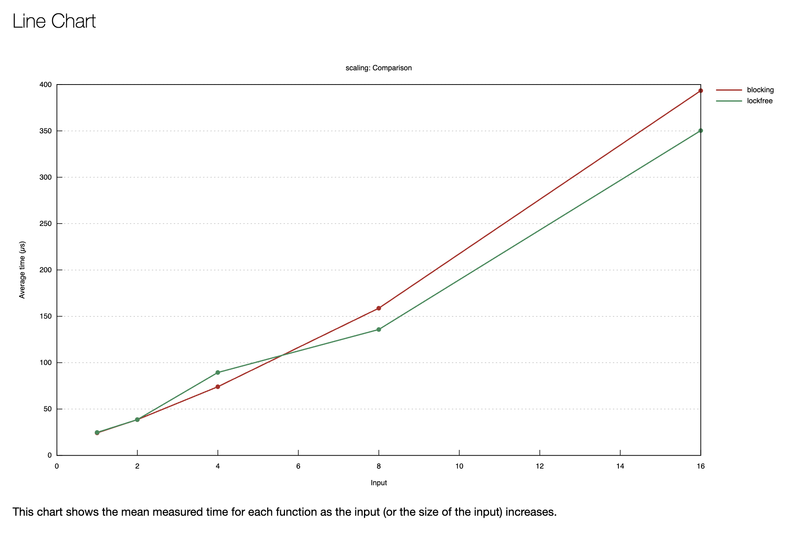
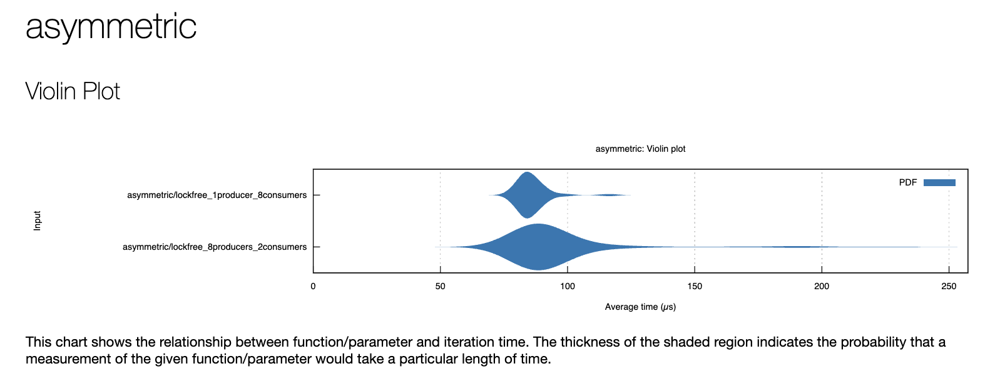

# Bounded MPMC Queue

A bounded multi producer multi consumer (MPMC) queue implemented in Rust using only `std` , no external crates for the queue itself. The queue supports multiple threads pushing and popping simultaneously without data races, backed by a fixed size ring buffer.<br> 

Two implementations are provided : one using standard locking primitives and one fully lock free , so their performance characteristics can be directly compared under varying contention scenarios.

## Project Structure

```
.
├── benches
│   └── throughput.rs          # Criterion benchmarks
├── src
│   ├── queue
│   │   ├── blocking.rs        # Mutex + Condvar implementation
│   │   ├── lockfree.rs        # Atomic sequence number implementation
│   │   ├── ring_buffer.rs     # Underlying ring buffer
│   │   └── slot.rs            # Per-slot data + sequence atomic
│   ├── sync
│   │   └── backoff.rs         # Exponential backoff strategy
│   ├── traits
│   │   └── bounded_queue.rs   # BoundedQueue<T> trait
│   └── utils
│       └── cache_pad.rs       # Cache line padding wrapper
└── tests
    ├── blocking.rs
    ├── lockfree.rs
    ├── fifo.rs
    ├── stress.rs
    └── asymemetrics.rs
```

## Implementations

### Blocking Queue (`BlockingQueue<T>`)

Wraps a `RingBuffer<T>` behind a `Mutex`, with two `Condvar`s called `not_full` and `not_empty` for producer and consumer coordination. The `push` operation acquires the lock and waits on `not_full` if the buffer is full, while `pop` waits on `not_empty` if the buffer is empty. Each successful push signals `not_empty`, and each successful pop signals `not_full`. The implementation is simple and correct, but the single global lock serializes all producers and consumers, which becomes a bottleneck as the number of threads grows.

### Lock-Free Queue (`LockFreeQueue<T>`)

Uses per slot atomic sequence numbers to coordinate producers and consumers without any global lock. Each slot holds a `sequence: AtomicUsize` alongside its data. A producer claims a slot by reading the tail position and verifying `seq == pos` (slot is empty), then doing a CAS on `tail` to reserve it. After writing, it sets `seq = pos + 1` to signal the slot is ready. A consumer claims a slot by verifying `seq == pos + 1` (slot is full), CASing `head`, reading the data, and then setting `seq = pos + capacity` to recycle the slot for the next lap. Head and tail are wrapped in `CachePadded` to prevent false sharing, and `push`/`pop` use an exponential `Backoff` on contention rather than spinning tight.

## Design Decisions

**Per slot sequence numbers instead of a global version counter** a single shared counter would re introduce serialization. Per slot sequences mean a producer and a consumer can be active on different slots simultaneously with no interference between them.

**`CachePadded` on head and tail** head and tail are written frequently by different threads. Without padding they would share a cache line, causing every write to invalidate the other thread's cached copy (false sharing). Padding each to 64 bytes gives them independent cache lines.

**Exponential backoff in `push`/`pop`** a tight CAS retry loop wastes memory bus bandwidth and starves other threads. The `Backoff` type increases the delay between retries, giving competing threads room to make progress and reducing overall cache coherence traffic.

**Separate `Condvar` per direction in the blocking queue** using `not_full` and `not_empty` separately means a producer only wakes consumers (not other producers), and a consumer only wakes producers. A single condvar would cause unnecessary thundering herd wakeups on every operation.

## Unsafe Code Justification

**1. Writing through `UnsafeCell` in `slot.rs`**

```rust
pub data: UnsafeCell<Option<T>>,
```

`data` is wrapped in `UnsafeCell` to allow interior mutability without a lock. The write (`*slot.data.get() = Some(item)`) and read (`(*slot.data.get()).take()`) are safe because the CAS on `slot.sequence` acts as the exclusive access gate only one thread can win the CAS for a given slot position, so no two threads ever touch `data` for the same slot concurrently.

**2. `unsafe impl Sync for Slot<T>` in `slot.rs`**

```rust
unsafe impl<T: Send> Send for Slot<T> {}
unsafe impl<T: Send> Sync for Slot<T> {}
```

The compiler refuses to derive `Sync` for `Slot` because `UnsafeCell` is not `Sync`. The manual impl is sound because the sequence number protocol enforces a strict happens before relationship: the producer's `store(pos + 1, Release)` after writing data synchronizes with the consumer's `load(Acquire)` that observes `seq == pos + 1` before reading. This guarantees the consumer always sees a fully written value and no data race is possible.

## Running Tests

```bash
cargo test
```

Tests cover sequential correctness, FIFO ordering, concurrent contention, boundary conditions, stress scenarios, and asymmetric producer consumer ratios for both implementations.

## Running Benchmarks

```bash
cargo bench
```

Criterion generates an HTML report under `target/criterion/`. Four benchmark groups are included:

| Group | What it measures |
|---|---|
| `blocking` | Throughput at 1/2/4/8/16 threads × 64/256/1024 capacity |
| `lockfree` | Same grid for the lock-free implementation |
| `scaling` | Both implementations side-by-side across thread counts at cap=1024 |
| `asymmetric` | 8 producers / 2 consumers and 1 producer / 8 consumers |

To view the full HTML report with graphs:
```bash
open target/criterion/report/index.html
```

## Benchmark Results

Benchmarks run on a 10 core machine. Each cell shows the median time to complete 100 push + 100 pop operations per thread.

### Scaling (capacity = 1024)

| Threads (prod + cons) | Blocking (µs) | Lock-free (µs) | Winner |
|---|---|---|---|
| 1 + 1 | 23.4 | 24.6 | Blocking |
| 2 + 2 | 38.9 | 38.9 | Tied |
| 4 + 4 | 72.2 | 99.8 | Blocking |
| 8 + 8 | 177.1 | 133.3 | **Lock-free** |
| 16 + 16 | 379.7 | 388.6 | Tied |

### Throughput by Capacity (median µs, all thread counts)

| Threads | Cap | Blocking | Lock-free |
|---|---|---|---|
| 1 | 64 | 26.7 | 21.7 |
| 1 | 256 | 22.6 | 21.6 |
| 1 | 1024 | 22.9 | 22.7 |
| 4 | 64 | 159.9 | 102.1 |
| 4 | 256 | 79.0 | 89.1 |
| 4 | 1024 | 81.2 | 86.3 |
| 8 | 64 | 519.9 | 214.7 |
| 8 | 256 | 233.1 | 183.5 |
| 8 | 1024 | 155.4 | 181.4 |
| 16 | 64 | 1281.1 | 472.1 |
| 16 | 256 | 544.3 | 384.5 |
| 16 | 1024 | 374.2 | 304.4 |

### Asymmetric Workloads (lock-free, capacity = 1024)

| Workload | Median (µs) |
|---|---|
| 8 producers / 2 consumers | 106.5 |
| 1 producer / 8 consumers | 83.4 |


## Benchmark Graphs

### Scaling — Blocking vs Lock-free


> Red = blocking, Green = lockfree. 
> Lockfree pulls ahead at 8 threads and stays faster through 16.

### Asymmetric Workloads


> 1 producer + 8 consumers (83µs) is faster and tighter 
> than 8 producers + 2 consumers (106µs).

## Key Findings

At low thread counts (1–4 threads), blocking and lock free performance are comparable, and the blocking queue occasionally wins because mutex acquisition is cheap when contention is low and there is no CAS retry overhead.

The crossover happens at **8 threads (4+4)**. Beyond that point the lock free queue pulls consistently ahead at 8 threads with cap=64 it is more than 2× faster (215 µs vs 520 µs). This is the point where the global mutex in the blocking queue becomes the dominant bottleneck: every push and pop serializes through it, and thread scheduling overhead for waking or sleeping on `Condvar` compounds the cost.

Larger capacity helps the blocking queue disproportionately at higher thread counts (cap=1024 at 8 threads: 155 µs vs cap=64: 520 µs) because threads block less often the buffer rarely fills or empties completely, so `Condvar` wakeups are less frequent.

At 16 threads on a 10 core machine both implementations converge again (~374–389 µs). At this point physical cores are fully saturated and the OS scheduler becomes the bottleneck for both, erasing the lock free advantage.

For asymmetric workloads, 1 producer or 8 consumers (83 µs) is notably faster than 8 producers or 2 consumers (106 µs). With a single producer there is zero contention on the tail pointer the bottleneck is purely on the consumer side where 8 threads compete on `head`, which scales better than having 8 threads hammering `tail` into a 1024 slot buffer that fills quickly.