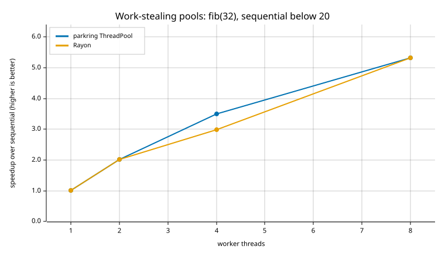

# Benchmarks

Measured on an Apple M4 (4 performance + 6 efficiency cores, 16 GB), macOS 27,
Rust 1.92, with the machine otherwise in normal desktop use. Reproduce with:

```sh
cargo bench -p parkring-bench            # throughput, latency, deque, pool
cargo run -p parkring-bench --release --example plot   # rewrites assets/*.svg, prints these tables
```

## Methodology

**Queue throughput** (`crates/parkring-bench/benches/throughput.rs`). For each
queue and shape, P producer and C consumer threads are spawned once and reused.
Each timed iteration releases them through a `Barrier`, moves 262,144 items,
and waits at a second barrier. Criterion reports the median time per
iteration, converted to million items per second (Melem/s) with a 95%
confidence interval. The original benchmark spawned up to 32 threads inside
every timed iteration and moved 100 items per thread, so it mostly measured
`thread::spawn`.

**Wake latency** (`latency.rs`, custom harness). A consumer blocks on an empty
queue; every 2 ms the producer pushes one item and times how long until `pop`
returns. The gap is long enough for parking queues to park, so this is the cost
of waking a parked thread; process CPU time shows what each strategy spends
while idle.

**Deque** (`deque.rs`). Owner-only push then pop of 65,536 values; and
pre-spawned thieves draining 65,536 values (only the draining is timed).

**Pool** (`pool.rs`). `fib(32)` with a sequential cutoff below 20
(compute-bound: the scaling measurement), `fib(25)` with a `join` at every
level (pure `join` overhead), and a chunked sum of 32 MB (memory-bound).

| queue | what it is |
|---|---|
| `lockfree` | this crate's `LockFreeQueue` (Vyukov) |
| `scq` | this crate's `ScqQueue` (Nikolaev's SCQ) |
| `crossbeam` | `crossbeam_queue::ArrayQueue`, waited on with the same spin/yield backoff; **never parks** |
| `blocking` | this crate's `BlockingQueue` |
| `std_sync_channel` | `std::sync::mpsc::sync_channel`, single-consumer shapes only (its receiver is `!Sync`) |

## Charts





## Results

### SPSC

| queue | producers | consumers | capacity | Melem/s (median) | 95% CI |
|---|---|---|---|---|---|
| lockfree | 1 | 1 | 16 | 16.0 | 15.9–16.1 |
| crossbeam | 1 | 1 | 16 | 16.9 | 16.7–17.0 |
| blocking | 1 | 1 | 16 | 2.3 | 2.3–2.3 |
| std_sync_channel | 1 | 1 | 16 | 4.1 | 4.1–4.1 |
| scq | 1 | 1 | 16 | 9.0 | 8.9–9.2 |
| lockfree | 1 | 1 | 256 | 91.1 | 90.4–92.0 |
| crossbeam | 1 | 1 | 256 | 84.8 | 83.9–85.6 |
| blocking | 1 | 1 | 256 | 12.2 | 12.1–12.5 |
| std_sync_channel | 1 | 1 | 256 | 29.3 | 28.4–29.5 |
| scq | 1 | 1 | 256 | 11.9 | 11.8–12.0 |
| lockfree | 1 | 1 | 4096 | 127.2 | 125.1–128.5 |
| crossbeam | 1 | 1 | 4096 | 120.7 | 119.7–121.8 |
| blocking | 1 | 1 | 4096 | 14.0 | 13.2–16.2 |
| std_sync_channel | 1 | 1 | 4096 | 64.5 | 60.4–64.8 |
| scq | 1 | 1 | 4096 | 12.8 | 12.5–13.3 |

### MPMC scaling

| queue | producers | consumers | capacity | Melem/s (median) | 95% CI |
|---|---|---|---|---|---|
| lockfree | 1 | 1 | 256 | 91.1 | 90.8–91.5 |
| crossbeam | 1 | 1 | 256 | 79.8 | 79.2–80.0 |
| blocking | 1 | 1 | 256 | 14.6 | 14.3–15.2 |
| std_sync_channel | 1 | 1 | 256 | 29.4 | 29.2–29.5 |
| scq | 1 | 1 | 256 | 12.6 | 12.3–12.8 |
| lockfree | 2 | 2 | 256 | 62.2 | 59.8–64.0 |
| crossbeam | 2 | 2 | 256 | 72.7 | 59.9–75.3 |
| blocking | 2 | 2 | 256 | 7.9 | 7.7–8.4 |
| scq | 2 | 2 | 256 | 7.3 | 7.2–7.4 |
| lockfree | 4 | 4 | 256 | 48.7 | 46.8–50.2 |
| crossbeam | 4 | 4 | 256 | 56.7 | 55.4–57.4 |
| blocking | 4 | 4 | 256 | 6.4 | 6.4–6.5 |
| scq | 4 | 4 | 256 | 6.1 | 6.0–6.3 |
| lockfree | 8 | 8 | 256 | 51.4 | 50.3–52.2 |
| crossbeam | 8 | 8 | 256 | 56.5 | 55.0–57.2 |
| blocking | 8 | 8 | 256 | 6.1 | 5.9–6.6 |
| scq | 8 | 8 | 256 | 6.8 | 6.6–7.0 |
| lockfree | 16 | 16 | 256 | 46.0 | 39.3–48.3 |
| crossbeam | 16 | 16 | 256 | 53.2 | 46.5–55.0 |
| blocking | 16 | 16 | 256 | 4.3 | 4.1–4.6 |
| scq | 16 | 16 | 256 | 6.9 | 6.6–7.2 |

### Asymmetric

| queue | producers | consumers | capacity | Melem/s (median) | 95% CI |
|---|---|---|---|---|---|
| lockfree | 2 | 8 | 256 | 17.5 | 15.8–18.6 |
| crossbeam | 2 | 8 | 256 | 19.3 | 18.3–23.5 |
| blocking | 2 | 8 | 256 | 2.3 | 2.3–2.4 |
| scq | 2 | 8 | 256 | 2.0 | 1.9–2.1 |
| lockfree | 8 | 1 | 256 | 7.4 | 7.1–7.9 |
| crossbeam | 8 | 1 | 256 | 12.8 | 12.0–14.9 |
| blocking | 8 | 1 | 256 | 0.6 | 0.6–0.6 |
| std_sync_channel | 8 | 1 | 256 | 2.5 | 2.4–2.5 |
| scq | 8 | 1 | 256 | 1.5 | 1.5–1.6 |
| lockfree | 8 | 2 | 256 | 18.3 | 17.5–19.5 |
| crossbeam | 8 | 2 | 256 | 22.4 | 21.4–24.1 |
| blocking | 8 | 2 | 256 | 2.3 | 2.2–2.3 |
| scq | 8 | 2 | 256 | 2.1 | 2.1–2.1 |

### Capacity sweep

| queue | producers | consumers | capacity | Melem/s (median) | 95% CI |
|---|---|---|---|---|---|
| lockfree | 4 | 4 | 16 | 19.5 | 19.2–19.7 |
| crossbeam | 4 | 4 | 16 | 19.2 | 19.1–19.4 |
| blocking | 4 | 4 | 16 | 1.0 | 1.0–1.0 |
| scq | 4 | 4 | 16 | 5.4 | 5.4–5.7 |
| lockfree | 4 | 4 | 256 | 48.1 | 46.4–49.1 |
| crossbeam | 4 | 4 | 256 | 55.4 | 53.8–56.0 |
| blocking | 4 | 4 | 256 | 6.6 | 6.5–6.6 |
| scq | 4 | 4 | 256 | 6.4 | 6.2–6.4 |
| lockfree | 4 | 4 | 4096 | 83.2 | 81.7–86.2 |
| crossbeam | 4 | 4 | 4096 | 76.8 | 75.5–78.3 |
| blocking | 4 | 4 | 4096 | 9.6 | 9.4–9.8 |
| scq | 4 | 4 | 4096 | 6.2 | 6.1–6.3 |

### Deque: owner push + pop

| implementation | parameter | median | throughput |
|---|---|---|---|
| crossbeam | Box<u64> | 1.37 ms | 47.9 Melem/s |
| crossbeam | u64 | 2.37 ms | 27.6 Melem/s |
| parkring | u64 | 1.29 ms | 50.8 Melem/s |

### Deque: thieves draining 65,536 items

| implementation | parameter | median | throughput |
|---|---|---|---|
| crossbeam_box | 1_thieves | 943.2 µs | 69.5 Melem/s |
| crossbeam_box | 2_thieves | 6.24 ms | 10.5 Melem/s |
| crossbeam_box | 4_thieves | 11.43 ms | 5.7 Melem/s |
| parkring | 1_thieves | 767.9 µs | 85.3 Melem/s |
| parkring | 2_thieves | 6.23 ms | 10.5 Melem/s |
| parkring | 4_thieves | 11.92 ms | 5.5 Melem/s |

### Pool: fib(32), sequential below 20

| implementation | parameter | median | throughput |
|---|---|---|---|
| parkring | 1 | 7.10 ms |  |
| parkring | 2 | 3.58 ms |  |
| parkring | 4 | 2.07 ms |  |
| parkring | 8 | 1.36 ms |  |
| rayon | 1 | 7.09 ms |  |
| rayon | 2 | 3.58 ms |  |
| rayon | 4 | 2.42 ms |  |
| rayon | 8 | 1.36 ms |  |
| sequential | 1 | 7.22 ms |  |

### Pool: fib(25) with join at every level (overhead)

| implementation | parameter | median | throughput |
|---|---|---|---|
| parkring | 1 | 1.13 ms |  |
| parkring | 4 | 446.8 µs |  |
| parkring | 8 | 581.5 µs |  |
| rayon | 1 | 1.29 ms |  |
| rayon | 4 | 538.0 µs |  |
| rayon | 8 | 374.0 µs |  |
| sequential | 1 | 283.5 µs |  |

### Pool: parallel sum of 4 M u64s (memory-bound)

| implementation | parameter | median | throughput |
|---|---|---|---|
| parkring | 1 | 640.8 µs |  |
| parkring | 4 | 602.3 µs |  |
| parkring | 8 | 658.0 µs |  |
| rayon | 1 | 654.2 µs |  |
| rayon | 4 | 591.8 µs |  |
| rayon | 8 | 687.0 µs |  |
| sequential | 1 | 613.9 µs |  |

### Wake latency

| queue | p50 (µs) | p90 (µs) | p99 (µs) | CPU while idle |
|---|---|---|---|---|
| lockfree | 9.4 | 13.1 | 19.5 | 1.7% |
| scq | 9.9 | 13.7 | 22.0 | 1.7% |
| crossbeam | 0.3 | 3.4 | 5.4 | 100.0% |
| blocking | 9.8 | 14.0 | 24.8 | 1.4% |
| std_sync_channel | 8.8 | 12.8 | 18.4 | 1.3% |

## Interpretation

* **`LockFreeQueue` against crossbeam.** Faster with one producer and one
  consumer (91 against 80 Melem/s at capacity 256; 127 against 121 at 4096),
  within 10–15% under symmetric contention, and behind in the asymmetric
  shapes, most of all with 8 producers and 1 consumer. Against the mutex queue
  it moves 7–12× as many items in every contended shape.
* **Idle cost is the design's point.** crossbeam's queue has no blocking API,
  so a waiting consumer must spin: it wakes in 0.3 µs but uses a whole core.
  Every parking queue here wakes in about 9–10 µs and uses under 2% of a core.
  The futex parker is about 10% faster to wake than the condvar version
  (DESIGN.md §4).
* **`ScqQueue` is slower, by a lot.** 7× slower than `LockFreeQueue` with one
  producer and one consumer, 8× at 4 + 4. It never retries a claim and never
  waits on a particular thread, but each item touches two rings and a data
  cell, and on 10 ARM cores a CAS retry is cheap. `docs/SCQ.md` §7 has the
  profiling. It is here for its progress guarantee and as a verified
  implementation of the paper, not for speed.
* **The deque matches crossbeam-deque.** Owner push/pop: 51 against 48 Melem/s
  (both boxing each value). One thief draining: 85 against 70. With 2 and 4
  thieves both are equally limited by contention on `top`. crossbeam with
  unboxed `u64` measured slower than with `Box<u64>` in every run (28 against
  48 Melem/s); we have not investigated why.
* **The pool matches Rayon on compute-bound work.** `fib(32)` with a cutoff:
  identical at 1, 2 and 8 threads, faster at 4, and 5.3× over sequential at 8
  threads. With a `join` at every level (`fib(25)`), both pools are slower than
  sequential code: a join costs more than a two-instruction leaf. Ours is
  faster than Rayon at 1 and 4 threads there and slower at 8, where its joiners
  spin rather than park. The 32 MB sum is limited by memory bandwidth, so no
  pool speeds it up.

## Caveats

* macOS offers no thread pinning, and the scheduler moves threads between
  performance and efficiency cores. Variance shows in the confidence
  intervals, especially above 8 threads (16 + 16 is 32 threads on 10 cores).
* Absolute numbers depend on the machine. Compare within one run, and use
  `--save-baseline` / `--baseline` for before-and-after measurements.
* Queue items are `u64`; larger items shift cost toward copying.
