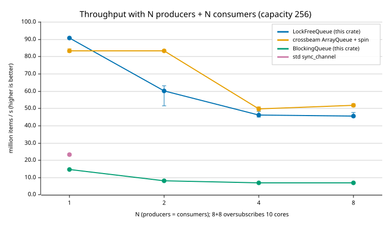
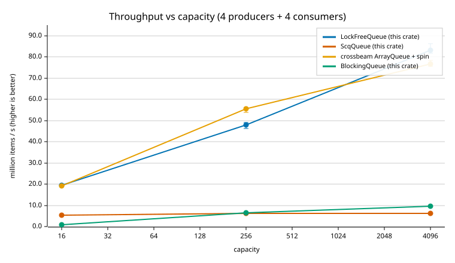
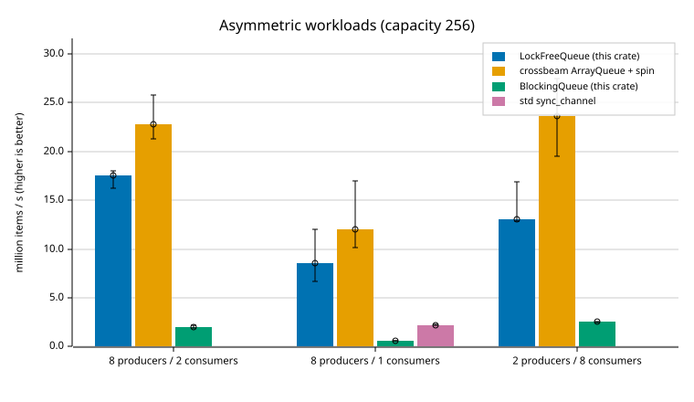
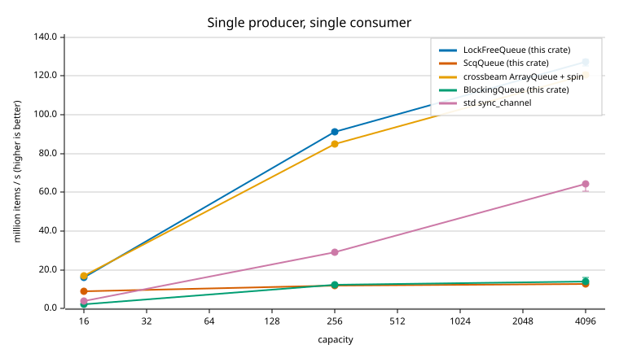
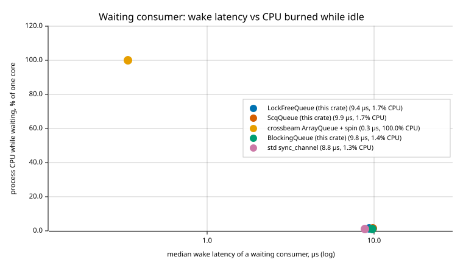

# Benchmarks

All numbers were measured on an Apple M4 (4 performance + 6 efficiency cores,
16 GB), macOS 27, Rust 1.92, with `cargo bench`. They are reproducible:

```sh
cargo bench -p parkring-bench --bench throughput
cargo bench -p parkring-bench --bench latency
cargo run -p parkring-bench --release --example plot   # rewrites assets/*.svg, prints these tables
```

## Methodology

**Throughput** (`crates/parkring-bench/benches/throughput.rs`). For each queue and shape, P producer
and C consumer threads are spawned once and reused. Each timed iteration
releases them through a `Barrier`, moves 262,144 items, and waits for all of
them at a second barrier. Criterion reports the median time per iteration, which
the plot example converts to million items per second (Melem/s) with a 95%
confidence interval.

The original benchmark spawned up to 32 threads inside every timed iteration
and moved 100 items per thread. Its numbers mostly measured `thread::spawn`,
which is why they showed the two queues "tied" at low thread counts.

**Wake latency** (`crates/parkring-bench/benches/latency.rs`). A consumer blocks on an empty queue.
Every 2 ms the producer pushes one item and measures how long until the
consumer returns from `pop`. The gap is long enough for parking queues to park,
so this is the cost of waking a parked thread. Process CPU time over the run
shows what each strategy spends while idle. This is a custom harness because
every sample needs an idle gap, and percentiles plus CPU are the interesting
output.

**Queues compared.**

| name | what it is |
|---|---|
| `lockfree` | this crate's `LockFreeQueue` |
| `crossbeam` | `crossbeam_queue::ArrayQueue`, a mature Vyukov-style ring. It has no blocking API, so the adapter waits with the same spin-then-yield `Backoff` and **never parks** |
| `blocking` | this crate's `BlockingQueue` |
| `std_sync_channel` | `std::sync::mpsc::sync_channel`. Its receiver is `!Sync`, so it is measured only with one consumer, behind an uncontended mutex |

## Results








### SPSC

| queue | producers | consumers | capacity | Melem/s (median) | 95% CI |
|---|---|---|---|---|---|
| lockfree | 1 | 1 | 16 | 15.9 | 15.8–15.9 |
| crossbeam | 1 | 1 | 16 | 20.7 | 20.1–21.3 |
| blocking | 1 | 1 | 16 | 2.3 | 2.3–2.3 |
| std_sync_channel | 1 | 1 | 16 | 4.1 | 4.0–4.1 |
| lockfree | 1 | 1 | 256 | 91.4 | 90.8–91.5 |
| crossbeam | 1 | 1 | 256 | 84.5 | 83.8–85.0 |
| blocking | 1 | 1 | 256 | 15.0 | 14.8–15.3 |
| std_sync_channel | 1 | 1 | 256 | 15.4 | 13.2–25.4 |
| lockfree | 1 | 1 | 4096 | 106.7 | 106.1–107.4 |
| crossbeam | 1 | 1 | 4096 | 113.0 | 110.5–114.9 |
| blocking | 1 | 1 | 4096 | 15.5 | 15.2–15.7 |
| std_sync_channel | 1 | 1 | 4096 | 52.3 | 51.7–52.9 |

### MPMC scaling

| queue | producers | consumers | capacity | Melem/s (median) | 95% CI |
|---|---|---|---|---|---|
| lockfree | 1 | 1 | 256 | 90.9 | 90.5–91.1 |
| crossbeam | 1 | 1 | 256 | 83.5 | 82.4–84.5 |
| blocking | 1 | 1 | 256 | 14.8 | 14.6–15.0 |
| std_sync_channel | 1 | 1 | 256 | 23.3 | 22.8–23.9 |
| lockfree | 2 | 2 | 256 | 60.2 | 51.6–63.2 |
| crossbeam | 2 | 2 | 256 | 83.5 | 82.9–83.9 |
| blocking | 2 | 2 | 256 | 8.3 | 7.8–8.7 |
| lockfree | 4 | 4 | 256 | 46.2 | 45.1–48.4 |
| crossbeam | 4 | 4 | 256 | 49.7 | 48.5–51.1 |
| blocking | 4 | 4 | 256 | 7.1 | 7.1–7.1 |
| lockfree | 8 | 8 | 256 | 45.8 | 45.1–47.7 |
| crossbeam | 8 | 8 | 256 | 51.8 | 51.1–52.9 |
| blocking | 8 | 8 | 256 | 6.9 | 6.7–7.2 |

### Asymmetric

| queue | producers | consumers | capacity | Melem/s (median) | 95% CI |
|---|---|---|---|---|---|
| lockfree | 2 | 8 | 256 | 13.0 | 12.8–16.8 |
| crossbeam | 2 | 8 | 256 | 23.7 | 19.5–27.4 |
| blocking | 2 | 8 | 256 | 2.5 | 2.5–2.6 |
| lockfree | 8 | 1 | 256 | 8.6 | 6.6–12.0 |
| crossbeam | 8 | 1 | 256 | 12.0 | 10.2–16.9 |
| blocking | 8 | 1 | 256 | 0.6 | 0.6–0.6 |
| std_sync_channel | 8 | 1 | 256 | 2.2 | 2.2–2.3 |
| lockfree | 8 | 2 | 256 | 17.5 | 16.2–18.0 |
| crossbeam | 8 | 2 | 256 | 22.8 | 21.3–25.8 |
| blocking | 8 | 2 | 256 | 2.0 | 1.9–2.2 |

### Capacity sweep

| queue | producers | consumers | capacity | Melem/s (median) | 95% CI |
|---|---|---|---|---|---|
| lockfree | 4 | 4 | 16 | 18.7 | 18.4–19.0 |
| crossbeam | 4 | 4 | 16 | 19.3 | 19.1–20.0 |
| blocking | 4 | 4 | 16 | 1.1 | 1.1–1.1 |
| lockfree | 4 | 4 | 256 | 43.9 | 42.8–45.7 |
| crossbeam | 4 | 4 | 256 | 49.3 | 48.1–51.2 |
| blocking | 4 | 4 | 256 | 6.7 | 6.6–6.7 |
| lockfree | 4 | 4 | 4096 | 83.9 | 80.3–86.2 |
| crossbeam | 4 | 4 | 4096 | 78.1 | 76.8–82.1 |
| blocking | 4 | 4 | 4096 | 10.0 | 10.0–10.1 |

### Wake latency

| queue | p50 (µs) | p90 (µs) | p99 (µs) | CPU while idle |
|---|---|---|---|---|
| lockfree | 10.1 | 13.8 | 19.5 | 1.7% |
| crossbeam | 0.5 | 3.5 | 13.8 | 99.7% |
| blocking | 9.9 | 14.0 | 20.2 | 1.3% |
| std_sync_channel | 8.8 | 12.8 | 18.0 | 1.2% |

## Interpretation

* **Against the mutex.** `LockFreeQueue` moves 6–7 times as many items as
  `BlockingQueue` in every contended shape, and the gap widens as capacity
  shrinks, because the mutex serialises every operation and small buffers
  force constant condvar handoffs.
* **Against crossbeam.** With one producer and one consumer the two are
  equivalent. Under contention `LockFreeQueue` is within roughly 10% of
  crossbeam in the symmetric shapes, and crossbeam leads clearly in the
  asymmetric ones. Part of the difference is structural: once a thread has
  parked, every push or pop that wakes it takes a mutex. The crossbeam adapter
  never parks, so it never pays that, and it pays instead in idle CPU.
* **The trade-off.** The wake-latency chart is the reason the design exists. A
  consumer waiting on crossbeam's queue with a spin/yield loop wakes in about
  half a microsecond but burns a whole core while idle. `LockFreeQueue` wakes in
  about 10 µs, the cost of a condvar wakeup, and uses under 2% of a core. That is
  the same wake cost as `std` channels and the mutex queue, which also park.
* **Tuning found by measuring.** An earlier version snoozed (spun, then
  yielded) while waiting for a peer that was mid-operation, and spun on a stale
  position. Swapping the two to match crossbeam raised 4+4 throughput by about
  25%. A peer mid-operation finishes within nanoseconds, so yielding the core
  is too expensive there.

## Caveats

* macOS offers no thread pinning, and the scheduler moves threads between
  performance and efficiency cores. Run-to-run variance is visible in the
  confidence intervals, especially for oversubscribed shapes. 8+8 is 16 threads
  on 10 cores.
* Absolute numbers depend heavily on the machine. Compare queues within one run,
  and use `--save-baseline` / `--baseline` for before-and-after comparisons.
* Items are `u64`. Larger items shift costs toward copying.
